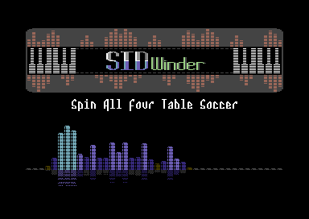
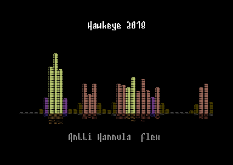
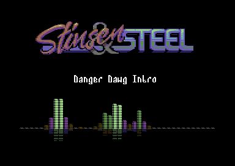
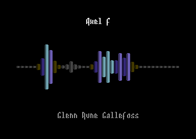
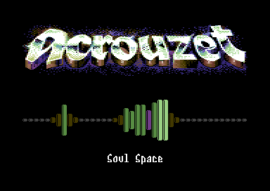
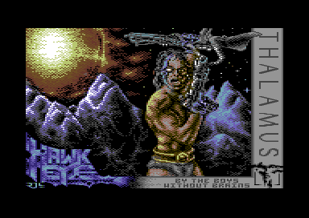

# SIDwinder

*SIDwinder 0.2.3 - C64 SID Music File Processor*

<p align="center"></p>

Developed by Robert Troughton (Raistlin of Genesis Project)

## Overview

SIDwinder is a versatile tool for processing C64 SID music files. It provides several key functions:

- **Player**: Convert SID files to executable PRG files with various player routines
- **Relocate**: Move SID music to different memory addresses while preserving functionality
- **Disassemble**: Convert SID files to human-readable assembly language
- **Trace**: Analyze SID register access patterns for debugging and verification

## Screenshots

<p align="center">

</p>

### Available Player Types

<table>
<tr>
<td><br/><center>RaistlinBars</center></td>
<td><br/><center>RaistlinBarsWithLogo (Default Logo)</center></td>
</tr>
<tr>
<td><br/><center>RaistlinBarsWithLogo (Custom Logo)</center></td>
<td><br/><center>RaistlinMirrorBars</center></td>
</tr>
<tr>
<td><br/><center>RaistlinMirrorBarsWithLogo</center></td>
<td><br/><center>SimpleRaster</center></td>
</tr>
<tr>
<td><br/><center>SimpleBitmap</center></td>
</tr>
</table>

## Basic Usage

```
SIDwinder [command] [options] inputfile [outputfile]
```

## Commands

SIDwinder supports the following main commands:

### `-player[=<type>]` 
Links a SID file with a player routine to create an executable PRG file.

```
SIDwinder -player music.sid music.prg
```

Options:
- Use `-player` for the default player (SimpleRaster)
- Use `-player=<type>` to specify a different player (e.g., `-player=SimpleBitmap` or `-player=RaistlinBars`)
- `-playeraddr=<address>`: Player load address (default: $4000)
- `-define <key>=<value>`: Pass custom definitions to the player (can be used multiple times)

### `-relocate=<address>`
Relocates a SID file to a different memory address. By default, performs verification to ensure the relocated file behaves identically to the original.

```
SIDwinder -relocate=$2000 music.sid relocated.sid
```

The address parameter is required and specifies the target memory location (e.g., $2000).

Options:
- `-noverify`: Skip verification after relocation (faster, but less safe)

### `-disassemble`
Disassembles a SID file to assembly code.

```
SIDwinder -disassemble music.sid music.asm
```

### `-trace[=<file>]`
Traces SID register writes during emulation.

```
SIDwinder -trace music.sid
```

Options:
- Use `-trace` to output to default file (trace.bin in binary format)
- Use `-trace=<file>` to specify output file
  - Files with .txt or .log extension use text format
  - Files with other extensions use binary format
- `-frames=<num>`: Number of frames to emulate (default: 30000)

## General Options

These options can be used with any command:

- `-verbose`: Enable verbose logging
- `-force`: Force overwrite of output file
- `-log=<file>`: Log file path (default: SIDwinder.log)
- `-kickass=<path>`: Path to KickAss.jar assembler
- `-exomizer=<path>`: Path to Exomizer compression tool
- `-nocompress`: Disable compression for PRG output

## SID Metadata Options

- `-title=<text>`: Override SID title
- `-author=<text>`: Override SID author
- `-copyright=<text>`: Override SID copyright
- `-sidloadaddr=<address>`: Override SID load address
- `-sidinitaddr=<address>`: Override SID init address
- `-sidplayaddr=<address>`: Override SID play address

## Configuration System

SIDwinder features a comprehensive configuration system that allows you to customize default settings. When you first run SIDwinder, it automatically creates a configuration file (`SIDwinder.cfg`) that contains all available settings with their default values.

### Configuration File Location

SIDwinder looks for the configuration file in the following locations, in order:
1. The current working directory
2. The executable's directory

### Editing the Configuration File

The configuration file is a plain text file that you can edit with any text editor. Each setting is defined in a `key=value` format, with sections organized by comments.

Example configuration entries:
```
# Path to KickAss jar file (include 'java -jar' prefix if needed)
kickassPath=java -jar KickAss.jar -silentMode

# Number of frames to emulate for analysis and tracing
emulationFrames=30000
```

### Common Configuration Settings

Here are some common settings you might want to customize:

#### Tool Paths
- `kickassPath`: Path to KickAss assembler (e.g., `java -jar C:\Tools\KickAss.jar -silentMode`)
- `exomizerPath`: Path to Exomizer compression tool
- `pucrunchPath`: Path to Pucrunch compression tool (alternative to Exomizer)
- `compressorType`: Preferred compression tool (`exomizer` or `pucrunch`)

#### Player Settings
- `playerName`: Default player routine to use (e.g., `SimpleRaster`, `SimpleBitmap`, `RaistlinBars`)
- `playerAddress`: Default memory address for player code (e.g., `$4000`)
- `playerDirectory`: Directory containing player code files

#### Emulation Settings
- `emulationFrames`: Number of frames to emulate (default: `30000`, about 10 minutes of C64 time)
- `cyclesPerLine`: CPU cycles per scan line (PAL: `63.0`, NTSC: `65.0`)
- `linesPerFrame`: Scan lines per frame (PAL: `312.0`, NTSC: `263.0`)

#### Logging Settings
- `logFile`: Default log file path
- `logLevel`: Logging detail level (1=Error, 2=Warning, 3=Info, 4=Debug)

#### Development Settings
- `debugComments`: Include debug comments in generated assembly (`true` or `false`)
- `keepTempFiles`: Preserve temporary files after processing (`true` or `false`)

### When to Use Configuration vs. Command Line

- **Configuration File**: Use for persistent changes that you want to apply to all operations (e.g., paths to external tools, emulation performance settings, default player preferences)
- **Command Line Options**: Use for operation-specific settings that vary by task (e.g., specific relocate addresses, trace file names)

### Configuration Updates

The configuration file is automatically updated with new settings when SIDwinder adds features. Your custom settings will be preserved during updates.

## Player Types

SIDwinder includes several player routines:

- **SimpleRaster**: Basic raster-based player (default)
- **SimpleBitmap**: Player with bitmap display capabilities
- **RaistlinBars**: Advanced spectrum analyzer visualization
- **RaistlinBarsWithLogo**: RaistlinBars with custom logo support
- **RaistlinMirrorBarsWithLogo**: Mirrored bars effect with logo

Additional player types may be available in the SIDPlayers directory.

### Using Custom Logos with Players

Some players (like `RaistlinBarsWithLogo`) support custom logos. You can specify a custom logo using the `-define` option:

```
SIDwinder -player=RaistlinBarsWithLogo -define KoalaFile="Logos/MyLogo.kla" music.sid music.prg
```

The logo should be in Koala format (.kla) and placed in a location accessible from the player directory.

## Examples

### Convert SID to PRG with default player:

```
SIDwinder -player music.sid music.prg
```

### Convert SID with specific player:

```
SIDwinder -player=SimpleBitmap music.sid player.prg
```

### Convert SID with RaistlinBars visualizer:

```
SIDwinder -player=RaistlinBars music.sid visualizer.prg
```

### Convert SID with custom logo:

```
SIDwinder -player=RaistlinBarsWithLogo -define KoalaFile="../../Logos/custom.kla" music.sid player.prg
```

### Define custom colors for a player:

```
SIDwinder -player=RaistlinBars -define BorderColor=$06 -define BackgroundColor=$00 music.sid player.prg
```

### Relocate SID to address $2000:

```
SIDwinder -relocate=$2000 music.sid relocated.sid
```

### Relocate SID without verification:

```
SIDwinder -relocate=$2000 -noverify music.sid relocated.sid
```

### Disassemble SID to assembly:

```
SIDwinder -disassemble music.sid music.asm
```

### Trace SID register writes to default output:

```
SIDwinder -trace music.sid
```

### Trace SID register writes to custom file:

```
SIDwinder -trace=music.log music.sid
```

### Trace with specific number of frames:

```
SIDwinder -trace -frames=1000 music.sid
```

## Supported File Formats

- **Input**: SID files (.sid)
- **Output**: 
  - PRG files (.prg) - Executable Commodore 64 programs
  - SID files (.sid) - Commodore 64 music format
  - ASM files (.asm) - Assembly language source code

## Requirements

- Java Runtime Environment (for KickAss assembler)
- KickAss Assembler (for assembling code)
- Exomizer (for compression, optional)

## Technical Details

SIDwinder includes a complete 6510 CPU emulator to analyze SID files and ensure accurate relocation and disassembly. It tracks memory access patterns to identify code, data, and jump targets, producing high-quality disassembly output with meaningful labels.

The relocation verification process traces SID register writes from both the original and relocated files to ensure they behave identically, guaranteeing that the relocation preserves all musical features.

## Advanced Features

### Player Development

SIDwinder analyzes SID files to generate helpful data for player development, including:
- Memory locations modified during playback
- SID register write patterns
- Optimal double-buffering strategies

This data is automatically included when building players, enabling advanced visualization techniques like those used in the RaistlinBars players.

### Custom Definitions

The `-define` option allows you to pass custom values to player code. These definitions become available as KickAss variables in the player assembly code:

```
SIDwinder -player=MyPlayer -define PlayerSpeed=2 -define ColorScheme=rainbow music.sid output.prg
```

In the player code, these would be accessible as:
```asm
.if (USERDEFINES_PlayerSpeed)
    .var speed = PlayerSpeed  // Will be 2
.endif
```

## Acknowledgements

- Zagon for Exomizer
- Mads Nielsen for KickAss assembler
- Adam Dunkels (Trident), Andy Zeidler (Shine), Burglar and Magnar Harestad for help
