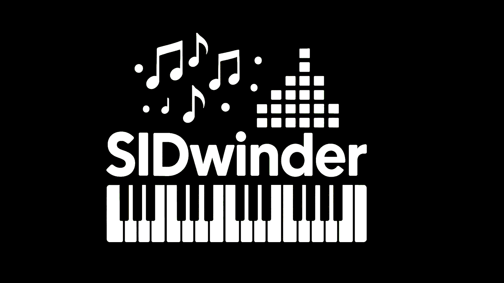
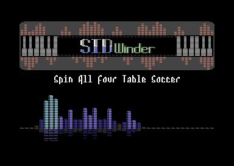
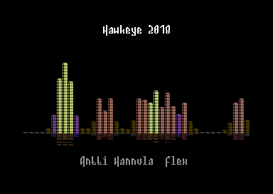
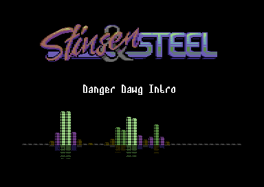
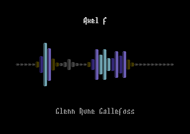
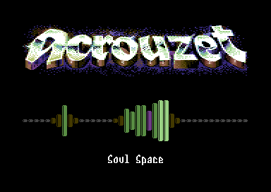
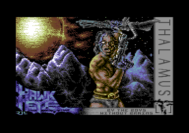

# SIDwinder

*C64 SID Music Analyzer & PRG Builder*

<p align="center"></p>

Developed by Robert Troughton (Raistlin of [Genesis Project](https://genesisproject.com))

## What is SIDwinder?

SIDwinder is a web-based tool for working with Commodore 64 SID music files. Drop in a .sid file and SIDwinder will:

- **Analyze** the tune using a full 6510 CPU emulator running in WebAssembly
- **Display** detailed technical info: memory usage, SID register writes, CIA timers, multi-SID detection
- **Build executable C64 PRGs** with your choice of visualizer effect, custom logos, and metadata
- **Browse HVSC** (High Voltage SID Collection) to find and load tunes directly

No plugins, no installs - runs entirely in your browser.

## Visualizers

SIDwinder includes 9 visualizer templates that can be linked with any SID tune to create a standalone C64 executable:

<p align="center">

</p>

<table>
<tr>
<td><br/><center>RaistlinBars</center></td>
<td><br/><center>RaistlinBarsWithLogo (Default Logo)</center></td>
</tr>
<tr>
<td><br/><center>RaistlinBarsWithLogo (Custom Logo)</center></td>
<td><br/><center>RaistlinMirrorBars</center></td>
</tr>
<tr>
<td><br/><center>RaistlinMirrorBarsWithLogo</center></td>
<td><br/><center>SimpleRaster</center></td>
</tr>
<tr>
<td><br/><center>SimpleBitmap</center></td>
</tr>
</table>

### Visualizer Types

| Visualizer | Description |
|------------|-------------|
| **Default** | Minimal text display with song info |
| **Default With Logo** | Text display with PETSCII logo area |
| **Simple Raster** | Classic rasterbar color effect |
| **Simple Bitmap** | Full-screen Koala bitmap background |
| **Simple Bitmap With Scroller** | Bitmap background with scrolling text |
| **Raistlin Bars** | Real-time frequency spectrum analyzer |
| **Raistlin Bars With Logo** | Spectrum bars with custom Koala logo |
| **Raistlin Mirror Bars** | Mirrored spectrum effect |
| **Raistlin Mirror Bars With Logo** | Mirrored bars with custom logo |

## Features

### SID Analysis
- Full 6510 CPU emulation via WebAssembly for accurate analysis
- Memory map visualization showing code vs data regions
- SID register write tracking across all voices
- Multi-SID chip detection (2SID, 3SID)
- CIA timer analysis for non-standard play routines
- Zero-page usage tracking

### PRG Export
- Automatic memory layout planning to avoid collisions between music and player code
- Multiple load address options ($4000, $8000, $C000) with automatic selection
- TSCrunch compression for smaller executables
- Custom metadata: edit song title, author, and copyright before export
- Custom logos: import PNG or Koala images, or use PETSCII text art
- Bar style and color palette customization for spectrum visualizers

### Image Conversion
- PNG to C64 multicolor bitmap conversion with palette matching
- PNG to PETSCII character art conversion
- 60+ authentic C64 color palettes (VICE, Pepto, Colodore, and more)
- Gallery of pre-made logos and backgrounds

### HVSC Browser
- Browse the complete High Voltage SID Collection
- Navigate by composer or category
- Load any tune directly into the analyzer
- Random tune picker from curated selections

## How It Works

1. **Load** a .sid file (drag-drop, file picker, or browse HVSC)
2. **Analyze** - SIDwinder emulates thousands of frames of 6510 execution to map memory usage and SID register patterns
3. **Choose** a visualizer template and customize options (logo, colors, bar style)
4. **Export** a .prg file ready to run on real C64 hardware or in an emulator (VICE, etc.)

## Development

### Prerequisites

- Java (for KickAss assembler)
- Python 3 (for frequency table generation)
- Emscripten SDK (for WASM compilation)

### Building

```
0-build.bat
```

This runs three steps:
1. Generates frequency lookup tables for spectrum analyzers
2. Compiles all SID player assembly to .bin files via KickAss
3. Compiles WASM modules from C++ via Emscripten

### Running Locally

```
1-runserver.bat
```

Or use any static file server pointing at the `public/` directory.

### Project Structure

```
public/           Web frontend (vanilla JS, no framework or build step)
wasm/             C++ sources for WASM modules (6510 emulator, SID processor, PNG converter)
SIDPlayers/       C64 assembly source for visualizer player routines
netlify/          Serverless function for HVSC proxy
```

See [ARCHITECTURE.md](ARCHITECTURE.md) for detailed component documentation.

## Technology

- **Frontend**: Vanilla JavaScript with ES6 classes - no framework, no bundler, no build step for JS
- **Emulation**: MOS 6510 CPU emulator compiled to WebAssembly via Emscripten
- **Assembly**: KickAss assembler for C64 player routines
- **Compression**: TSCrunch (JavaScript port) for self-extracting C64 executables
- **Hosting**: Netlify with serverless functions for HVSC proxy

## Acknowledgements

- Mads Nielsen for KickAss assembler
- Zagon for Exomizer
- The TSCrunch compression algorithm
- Adam Dunkels (Trident), Andy Zeidler (Shine), Burglar and Magnar Harestad for help and testing
- The HVSC team for maintaining the High Voltage SID Collection
